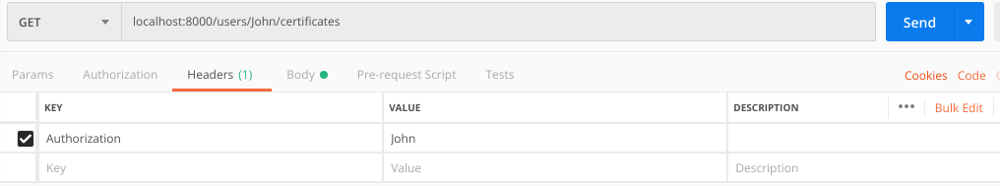

# Certificates Back-End

- Backend server fulfilling the purpose of performing CRUD operations on certificates for Verisart
- API's designed with REST architecture
- API Handlers can be found under `api/api.go`
```
User A creates a certificate
1. User A fills in the certificate details on the front-end and creates a certificate

User A updates a certificate
1. User A views a list of their certificates, clicks on one to open the edit page
2. The user updates the relevant information and saves the certificate

User A transfers a certificate
1. User A views a list of their certificates, clicks on one to transfer
2. The user enters the information of the person (User B) transferring to and submits.

User B accepts transferred certificates

1. User B recieves an email with a link to accept the transferred certificate
2. User B opens the accept transfer page and clicks "Accept" to finish the transfer
3. User B views a list of their certificates which includes the newly accepted certificate.
```

## Start the server
Run the executable in the root of the project `certificates.exe`
```$xslt
./certificates.exe 
```
- This will start the server on localhost:8000, ready for requests

## Build the project
- Clone the repository
```
git clone git@github.com:JohnChangUK/Certificates.git
cd Certificates
go build -o certificates.exe
./certificates.exe 
```

## Implemented Endpoints

```$xslt
Method: GET     /certificates                       "Gets all existing certificates"
Method: POST    /certificates                       "Creates a new certificate"
Method: GET     /certificates/{id}                  "Gets a certificate by certificate ID"
Method: PUT     /certificates/{id}                  "Updates a certificate by certificate ID"
Method: DELETE  /certificates/{id}                  "Deletes a certificate by certificate ID"
Method: POST    /certificates/{id}/transfers        "Creates a transfer request to User B"
Method: PUT     /certificates/{id}/transfers        "User B accepts received transfer request"
Method: PATCH   /certificates/{id}/transfers        "User B declines received transfer request"
```

## Usage of API
### Creating a certificate

- When creating a new certificate, make a POST request to the endpoint `localhost:8080/certificates`
and provide the `Title`, `Year` and `Note` in the Body of the Request
- You must pass in the headers the `Authorization` value, which is the `User Id`. In this instance, it's `John`


```$xslt
{
	"title": "New Verisart certificate",
	"year": 2019,
	"note": "New note"
}
```

The Backend generates a UUID for the certificate Id, timestamp creation, places the 
User Id as the certificate owner Id and an empty Transfer object
```$xslt
{
    "id": "bhpi8r6db2297ufreulg",
    "title": "New Verisart certificate",
    "created_at": "2019-02-24T23:10:36.090193214Z",
    "owner_id": "John",
    "year": 2019,
    "note": "New note",
    "transfer": {
        "email": "",
        "status": ""
    }
}
```

### Updating a certificate
- When updating an existing certificate, make a PUT request to the endpoint `localhost:8080/certificates/{id}`
and provide the `Title`, `Year` and `Note` in the body of the request.
- Pass in the headers the `Authorization` value, which is the original certificate's `Owner Id`: `John`
- We will be modifying the created certificate above by passing in the certificate Id as the 
path variable: `localhost:8000/certificates/bhpi8r6db2297ufreulg`
```$xslt
{
	"title": "Updated Verisart certificate",
	"year": 2019,
	"note": "Updated note"
}
```
- The Backend will make the changes accordingly and update the certificate
Payload response: 
```$xslt
{
    "id": "bhpi8r6db2297ufreulg",
    "title": "Updated Verisart certificate",
    "created_at": "2019-02-24T23:10:36.090193214Z",
    "owner_id": "John",
    "year": 2019,
    "note": "Updated note",
    "transfer": {
        "email": "",
        "status": ""
    }
}
```

### Initiating a certificate transfer
- To initiate a transfer from User A to User B, User A must send a POST request to the endpoint
`localhost:8000/certificates/{id}/transfers`, specifying the certificate Id
- Pass in the headers the `Authorization` value; the original certificate's `Owner Id`: `John`
- Provide the User's details in the Body of the request:
```$xslt
{
	"id": "UserB",
	"email": "userb@gmail.com",
	"name": "User B"
}
```
- Making a `POST` request to `localhost:8000/certificates/bhpi8r6db2297ufreulg/transfers` gives the payload:
```$xslt
{
    "id": "bhpi8r6db2297ufreulg",
    "title": "Updated Verisart certificate",
    "created_at": "2019-02-24T23:10:36.090193214Z",
    "owner_id": "John",
    "year": 2019,
    "note": "Updated note",
    "transfer": {
        "email": "userb@gmail.com",
        "status": "PENDING"
    }
}
```
- The Transfer object is now populated with User B's email and the status as `PENDING`

### Accepting a certificate transfer
- User B can accept the transfer by making a `PUT` request and going to the endpoint `localhost:8000/certificates/{id}/transfers`
- Once again, the `Authorization` value must be provided in the Headers, and must be the 
original certificate owner's Id. In this instance: `John`
- When User B receives the email to accept the transfer, it will make a `PUT` request to `localhost:8000/certificates/bhpi8r6db2297ufreulg/transfers`
- When making the request, User B's details must be provided in order for a successful transfer
- User B details in the body of the request:
```$xslt
{
	"id": "UserB",
	"email": "userb@gmail.com",
	"name": "User B"
}
```
Payload:
```$xslt
{
    "email": "userb@gmail.com",
    "status": "COMPLETE"
}
```
- The transfer has been successful with the Transfer object returned as the response
- We can check for this certificate's details by making a `GET` request to `localhost:8000/certificates/bhpi8r6db2297ufreulg`
- Response:
```$xslt
{
    "id": "bhpi8r6db2297ufreulg",
    "title": "Updated Verisart certificate",
    "created_at": "2019-02-24T23:10:36.090193214Z",
    "owner_id": "UserB",
    "year": 2019,
    "note": "Updated note",
    "transfer": {
        "email": "",
        "status": ""
    }
}
```
- If User B wanted to decline the request, a `PATCH` request to `localhost:8000/certificates/bhpi8r6db2297ufreulg`
would be made
- Again, the `Authorization` value must be provided in the Headers, and must be the original certificate 
owner's Id. In this instance: `John`
If User B declines, the payload returns:
```$xslt
{
    "email": "",
    "status": "DECLINED"
}
```
- Go to endpoint `localhost:8000/users/{userId}/certificates`, replace `{userId}` with `John` and the following returns:

```$xslt
{
    "id": "bhpi8r6db2297ufreulg",
    "title": "Updated Verisart certificate",
    "created_at": "2019-02-24T23:10:36.090193214Z",
    "owner_id": "John",
    "year": 2019,
    "note": "Updated note",
    "transfer": {
        "email": "",
        "status": ""
    }
}
```
- The transfer has been reset